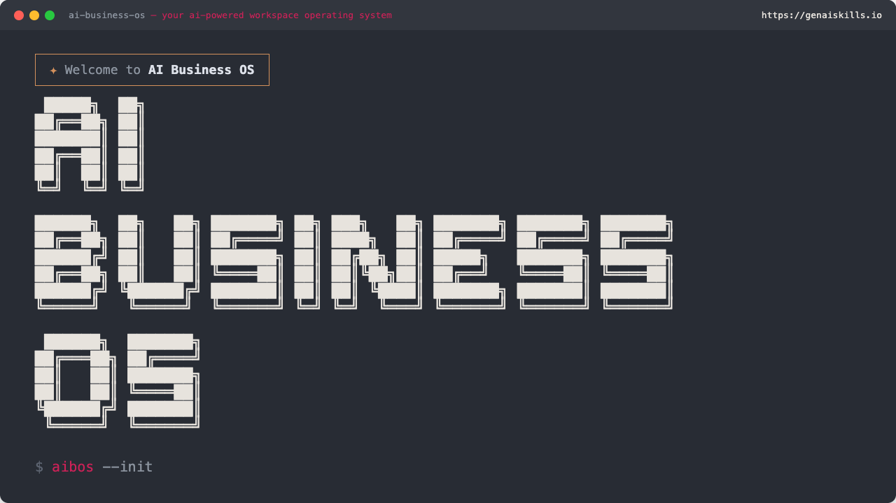

<p align="center">
  
</p>

# AI Business OS

**Engine version:** v2.4.1

A ready-made Claude Code workspace for non-technical businesses. Provides folder structure, commands, skills, rules, and documentation so you can start using Claude Code productively from day one.

## Quick Start

1. Click **"Use this template"** on GitHub to create your own copy
2. Clone your new repository
3. Open it in VS Code with Claude Code installed
4. Run `/setup` to personalise your workspace
5. Run `/day` to start your first session

## What's Included

### Folder Structure
```
your-biz-os/
├── .claude/                    Agent configuration (the engine)
│   ├── agents/                 Agent definitions
│   ├── commands/               Slash commands (/day, /night, etc.)
│   ├── company/                Your organisation context (voice, brand, team, etc.)
│   ├── config/                 Workspace configuration
│   ├── docs/                   Documentation and guides
│   ├── rules/                  Behavioural rules (auto-loaded)
│   ├── skills/                 Reusable workflow skills
│   └── state/                  Project state and schema
├── .vscode/                    VS Code settings and extensions
├── Archive/                    Completed or retired items
├── Clients/                    Client/customer folders
├── Documentation/              Templates and reports
├── 01 Finance/                 Accounts, budgets, tax, reporting
├── 02 Human Resources/         Recruitment, policies, training
├── 03 Sales/                   Pipeline, proposals, contracts
├── 04 Marketing/               Campaigns, content, social media
├── 05 Operations/              Processes, vendors, logistics
├── 06 Products/                Catalogue, development, pricing
├── 07 Legal/                   Contracts, compliance, IP
├── Infrastructure/             Engine scripts and hooks
│   └── Scripts/                Update, install, and validation scripts
├── Projects/                   Active work and workflows
└── Scripts/                    Operational scripts (PRIMA-managed)
```

Department folders (`01 Finance/` through `07 Legal/`) are numbered for consistent sort order and use hierarchical subfolder numbering (e.g., `01.1`, `01.2`). See [Folder Structure](.claude/docs/folder-structure.md) for a full guide including how to choose between Projects, Clients, and Department folders for organising your work.

### Commands
| Command | Purpose |
|---------|---------|
| `/setup` | First-time personalisation wizard |
| `/day` | Morning briefing — sync, scan projects, suggest priorities |
| `/night` | End-of-session — summarise work, commit, push |
| `/save` | Mid-session save — capture current state and return a resume reference before context limits are reached |
| `/status` | Overview of all projects and recent activity |
| `/sync` | Quick commit and push |
| `/newproject` | Create a new project folder |
| `/newclient` | Create a new client folder |
| `/timeline` | Interactive Gantt-style project timeline |
| `/install-pack` | Install an extension pack into the workspace |
| `/update` | Check for and apply engine updates |

### Skills (13 built-in)
- **Copywriting** — articles, blog posts, social media, landing pages, ads, funnels, headlines, editing
- **Search engine optimisation** — on-page SEO (Yoast-aligned), technical SEO audits, schema markup
- **Email drafting** — client responses, introductions, follow-ups, meeting requests, internal comms
- **Creating presentations** — slide decks from briefs with brand integration and speaker notes
- **Processing spreadsheets** — analyse CSV/Excel, identify trends, generate charts, add formulas
- **Processing documents** — create, edit, format Word documents with tracked changes
- **Processing PDFs** — extract, merge, split with automatic large-file handling (5-level scale)
- **Documenting workflows** — SOPs, checklists, playbooks, onboarding guides, process maps
- **Drafting documents** — proposals, reports, briefs, memos
- **Meeting notes** — structured summaries from meeting content
- **Client setup** — new client onboarding
- **Status reports** — workspace activity summaries
- **Creating skills** — build your own custom skills

All skills read from `.claude/company/` for voice, brand, and audience context. Users can customise any skill — from the second update onwards, edits are preserved across engine updates via three-way merge (the first update has no merge base yet; it reports any files it had to overwrite and keeps pre-update copies in `.claude/engine-backups/`).

### Rules
- Engine protection (three-tier file classification with PreToolUse hooks)
- Blocked commands (destructive action safeguards)
- Content defaults (language, tone, formality)
- File conventions (placement and naming)
- Autonomy levels (when Claude acts vs asks)
- PDF processing scale (5-level size classification)
- Checkpoint protocol (standardised approval points)

## Project Tracking

AI Business OS includes lightweight project tracking out of the box — project IDs, status values, a `state.json` file, and `/day`, `/night`, `/status` commands that read and update project state.

### Upgrade: PRIMA Plugin

[PRIMA Plugin](https://github.com/larrygmaguire-hash/prima-plugin) (Project Registration, Indexing & Management Assistant) upgrades the built-in tracking with:

- Session memory — where you stopped, what you did last, searchable history
- Automatic checkpoints — structured progress snapshots written silently to disk
- Enhanced `/day`, `/night`, `/status` with priority routing, overdue detection, and recommended actions
- `/resume` command — pick up exactly where you left off
- `/timeline` command — interactive Gantt-style project timelines with scope selection
- Duplicate detection — prevents accidental project duplication
- Richer state management — priorities, pending items, session history with project cross-references

The base commands work without PRIMA Plugin. PRIMA Plugin replaces them with fuller versions.

**`/save` is not replaced by PRIMA Plugin.** It remains active in any AI Business OS workspace regardless of whether PRIMA Plugin is installed. Use `/save` whenever you want to manually capture a stable state mid-session — before context limits are reached, before switching to a different task, or before a complex operation. `/save` writes a checkpoint to disk, updates project records in `state.json`, and returns a timestamped reference (`/resume HH:MM`) for the next session. PRIMA Plugin's automatic checkpoints (every ~20 tool calls) and `/night` complement this but do not replace the deliberate save point that `/save` provides.

## PRIMA Ecosystem

AI Business OS is the base platform. The PRIMA family of add-ons extends it with project management, session memory, client relationship management, visual dashboards, and academic research tools. Each component is a separate product. Install what you need.

| Component | Type | Requires | What It Does |
|-----------|------|----------|-------------|
| [PRIMA Plugin](https://github.com/larrygmaguire-hash/prima-plugin) | File-copy overlay | AI Business OS | Project management, enhanced commands, state tracking, session lifecycle |
| [PRIMA Memory](https://github.com/larrygmaguire-hash/prima-memory) | MCP server | AI Business OS | Session history search and context recovery across conversations |
| [PRIMA CRM](https://github.com/larrygmaguire-hash/prima-crm) | MCP server | PRIMA Plugin | Client and contact relationship management |
| [PRIMA Dashboard](https://github.com/larrygmaguire-hash/prima-dashboard) | File-copy overlay | PRIMA Plugin | Visual project dashboard — local HTML generated from PRIMA state, opens in any browser |
| [PRIMA Scholar](https://github.com/larrygmaguire-hash/prima-scholar) | Claude Code plugin | None (standalone) | Academic search, citation management, research library |

The authoritative source for component versions, dependencies, and install methods is `.claude/suite-registry.json`.

### Install: PRIMA Memory

```bash
mkdir -p .claude/mcp-servers
git clone https://github.com/larrygmaguire-hash/prima-memory.git .claude/mcp-servers/prima-memory
cd .claude/mcp-servers/prima-memory && npm install && npm run build
```

PRIMA Memory is registered in `.mcp.json` (workspace-scoped, already included in the template). Restart Claude Code after installing.

Each workspace gets its own isolated database at `.prima-memory/`, so no data leaks between workspaces.

## Updating

AI Business OS separates **engine files** (rules, skills, commands, scripts) from **your files** (CLAUDE.md, company knowledge, state, configuration). Engine updates never touch your customisations.

An `engine-manifest.json` lists every file owned by the template. Only files in the manifest are updated — your custom skills, projects, client data, and configuration are never touched. Backups are saved before every update and can be rolled back.

### How updates are delivered

There are two models depending on your arrangement:

**Managed workspaces** — Larry maintains your workspace on your behalf. He clones your repository, applies engine updates, and pushes the changes. You receive updates automatically the next time you pull or start a session. No action required on your part.

**Self-service workspaces** — You manage your own updates. Run `/update` in Claude Code to check for new engine versions and apply them. Your repository needs read access to the upstream template (configured automatically on first run).

### Running updates yourself

To check for and apply updates:

```
/update
```

Or from the terminal:

```bash
bash Infrastructure/Scripts/update-engine.sh
```

| Flag | Purpose |
|------|---------|
| `--dry-run` | Preview changes without applying |
| `--rollback` | Restore the previous engine version |
| `--force` | Apply without confirmation prompt |

## Requirements

- [VS Code](https://code.visualstudio.com/)
- [Claude Code](https://claude.com/claude-code) (VS Code extension)
- Git
- A GitHub account (for template cloning and sync)
- **Windows users:** [WSL](https://learn.microsoft.com/en-us/windows/wsl/install) (Windows Subsystem for Linux) — see [Getting Started](.claude/docs/getting-started.md) for setup steps

## Documentation

Full documentation is in `.claude/docs/`:
- [Getting Started](.claude/docs/getting-started.md)
- [Folder Structure](.claude/docs/folder-structure.md)
- [Available Automations](.claude/docs/available-automations.md)
- [Capabilities Reference](.claude/docs/capabilities-reference.md)
- [Glossary](.claude/docs/glossary.md)

## Licence

Copyright Larry G. Maguire / Human Performance. All rights reserved.

This software is provided under a proprietary licence. Unauthorised copying, distribution, or modification is not permitted without a valid licence. Contact hello@humanperformance.ie for licensing enquiries.

## Author

Larry G. Maguire — [Human Performance](https://humanperformance.ie)
